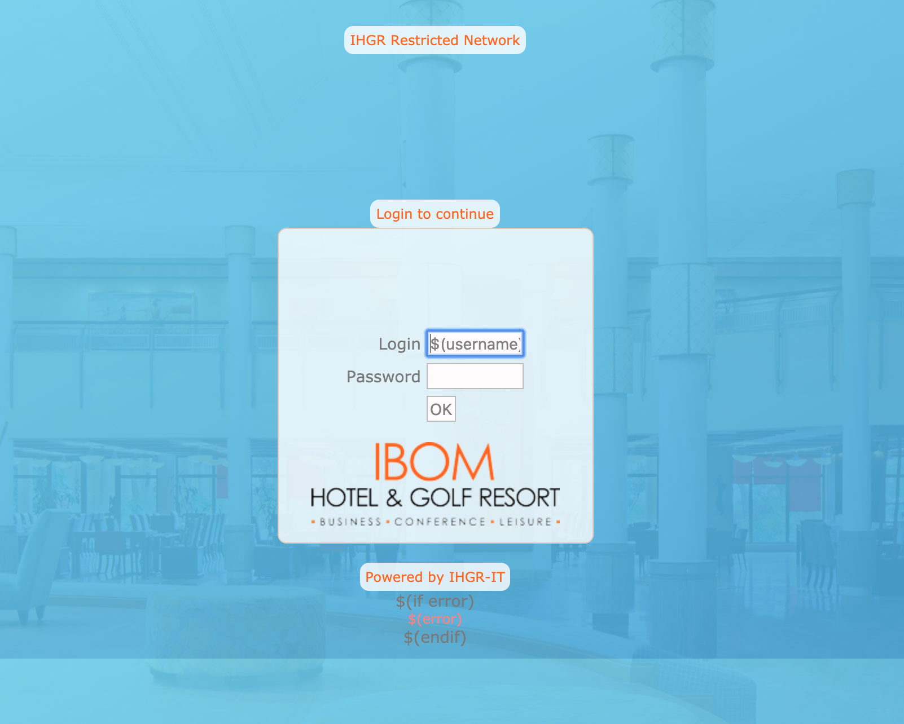

# Mikrotik Hotspot Login Page

> Mikrotik Hotspot login page for Ibom Golf Resort

A Hotspot is a way to provide wireless internet access to subscribers by means of an easy to use login interface.

This gives the owner of the hotspot full control over download limitations, speed/bandwidth management, and billing. A hotel, coffee shop, or conference center is a perfect example where a Hotspot would be implemented.

## Live Demo

[Live Demo Link](https://acushlakoncept.github.io/mikrotik_hotspot/login.html)

## Authors

**Uduak Essien**

-   Github: [@acushlakoncept](https://github.com/acushlakoncept/)
-   Twitter: [@acushlakoncept](https://twitter.com/acushlakoncept)
-   Linkedin: [acushlakoncept](https://www.linkedin.com/in/acushlakoncept/)

## 🤝 Contributing

Contributions, issues and feature requests are welcome!

Feel free to check the [issues page](issues/).

## Show your support

Give a ⭐️ if you like this project!

## Acknowledgments

-   Hat tip to anyone whose code was used
-   Inspiration
-   etc
